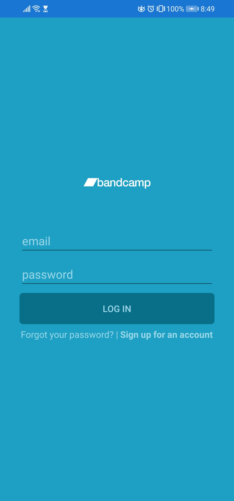
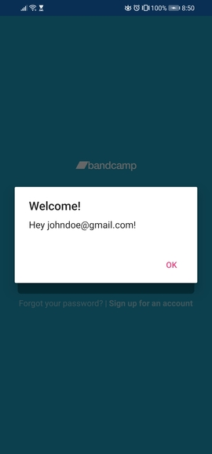
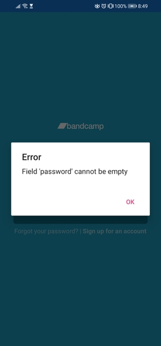

# Simple Xamarin Login

Project based on a practical assignment for the class "Desarrollo de Aplicaciones Moviles" from INTEC. 

## Getting started

It consists of a login screen made of two fields: `email`, `password`.

### Base Login 

## Use cases

### Success

Outputs an alert greeting the user if the fields are filled.

### Failure

Outputs an alert informing the user that a specific field from
the form cannot be empty.

